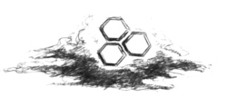
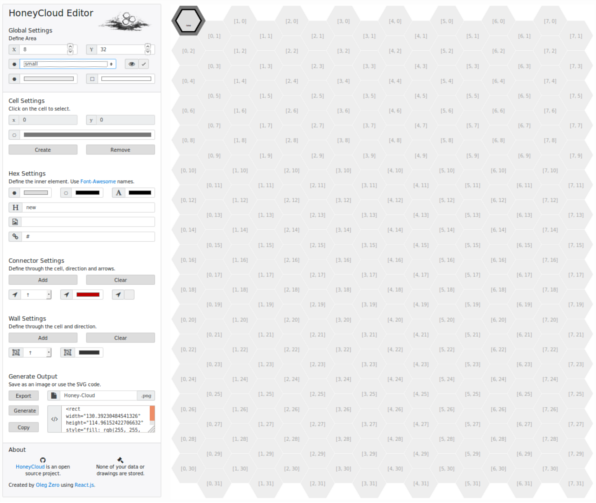
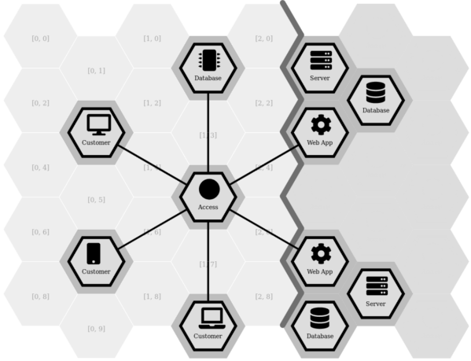
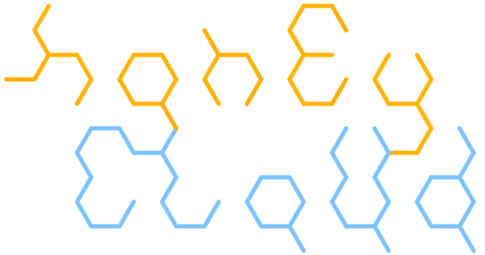
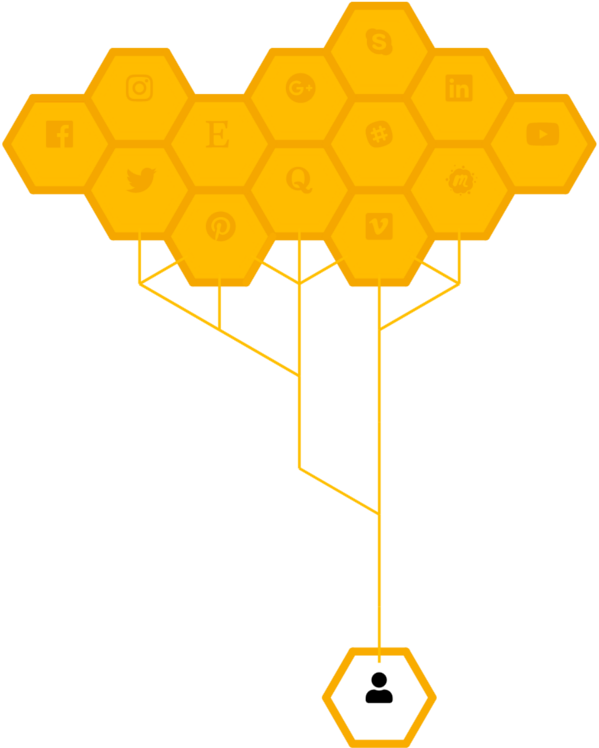
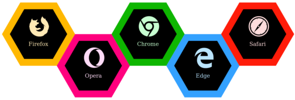

# HoneyCloud
_version 0.1.0_



***

## Introduction
The **HoneyCloud** provides a simple browser editor for creating hexagonal maps using [FontAwesome](https://origin.fontawesome.com/icons?d=gallery) icons and exporting the resulting images in PNG format.

The map is SVG-based and allowes you to generate the SVG specific code, so you can easily integrate the images in your websites.

### Where can I use it?
Just go [here](https://zerowithdot.com/projects/honeycloud/).
***

***

## Can I get more features?
I know that **HoneyCloud** is limited in featres.
If you want any features to be added, please send me an email: oleg@zerowthdot.com.

Feel free to branch it, fork it, change it.
I will welcome pull requests from you.


## Short User Guide
### Global parameters
The drawing area is defined by number of vertical and horizontal cells' count and the grid size that can be chosen between:
* extra small (around 80px in width),
* small (around 120px),
* medium (around 180px),
* large (around 240px),
* extra large (around 360px).

The _empty cells_ can be switched to invisible (they assume background color).
However, since the area is also used for selection, it is necessary to keep them on when drawing.

### Cells and Hex's
By clicking on the cells, you can create, edit or remove a cell.
The cells are defined using:
* background color,
* inner hexagon's background color,
* inner hexagon's edge color,
* color of the icon and text.

With the intention to be able to use the resulting images on websites as, for example, menus,
there exist one more field - link.

The link allows to let the icons work as links and direct users to different locations.

### Connectors
The connectors are the lines that point out from a selected cells.
In order to edit them, the respective cell needs to be selected together with the direction indicator.
It is also possible to toggle between having the lines possess arrows or not.

### Walls
The walls are similar to the connectors, but they work around the cells.
Editing works in the exact same way.

### Exporting the output
The output can be exported in two ways:
1. By clicking on the _Export_ button, the current state of the drawing area is converted to a PNG format and available for download.
2. By clicking on the _Generate_ button, the text field provided next to displays the current state in using the SVG syntax. All you need is to copy and paste it in to your website within the ```<svg>...</svg>``` tags.

### Clearing image
Most websites support F5... I mean, just refresh the page.

## About
This project was bootstrapped with [Create React App](https://github.com/facebookincubator/create-react-app).

## Gallery
The images below were produced using **HoneyCloud**.


***

***

***

***

